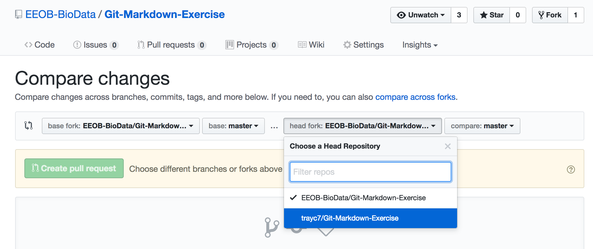
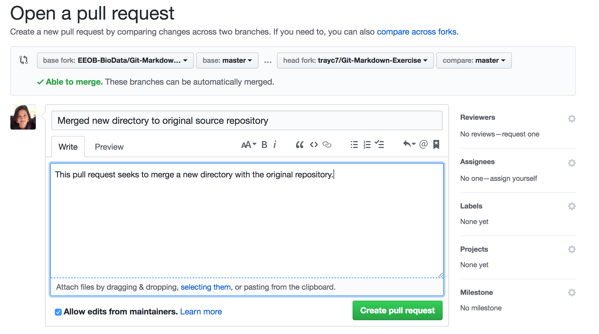

# EEOB/BCB 546X Git/Markdown Exercise

This exercise will take you through the process of using Git and Markdown. For this, you will first create a GitHub account. Once you have done that, you will 'fork' this repository to your account. Then you can clone your version of the repository to the class cluster (or your own machine) and then follow the instructions for working with Markdown. Once you have completed the Markdown file, you will push the changes to your repository.

## Get a GitHub User Account

First, you must make a user account on GitHub if you don't have one already. Be sure to choose a user ID that you are happy using for the rest of your professional career as a bioinformatician. GitHub is a very important tool for computational biology and if you continue working in data-intensive fields, you will be using this account again in the future. Join GitHub here:
[https://github.com/join](https://github.com/join).

Once you have an account, be sure to log in.

## Git Exercise Part 1

### Fork the Repository

Now that you have your own GitHub account you can fork [this](https://github.com/EEOB-BioData/Unix-Git-Exercise) repository.
A _fork_ creates a copy of a GitHub repository in your own GitHub account. Thus, you have permission to make changes to the content of your copied repository without ever changing the original one. At the time of your fork, you will copy all of the current contents and the two repositories are now independent. So if someone commits changes to the original repository, they will not affect your forked copy.

Fork the original repository [https://github.com/EEOB-BioData/Unix-Git-Exercise](https://github.com/EEOB-BioData/Unix-Git-Exercise) by clicking the **_Fork_** button at the upper right corner of the repository page.


This will take you to the GitHub page for your very own GitHub repository! It should have a URL like the one below (where `<your GitHub ID>` should be your new GitHub ID):

```
https://github.com/<your GitHub ID>/Unix-Git-Exercise
```

### Clone Your Repository on the HPC-Class Cluster

Now log on to the HPC-class cluster (replace `<ISU NetID>` with your ISU NetID):

```
ssh <ISU NetID>@hpc-class.its.iastate.edu
```

Once you have logged on to the cluster, clone your forked repository to your home directory (replace `<your GitHub ID>` with your GitHub ID):

```
git clone git@github.com:EEOB-BioData/Git-Markdown-Exercise.git
```

If you haven't added your SSH key to your GitHub account, you cannot use the URL above and will instead have to use `https` URL.

Now change to the `Unix-Git-Exercise` directory and follow the Unix exercise steps in the next section.

```
cd Git-Markdown-Exercise
```

## Markdown Exercise

For this part of the exercise, we ask that you create a document that is formatted in Markdown in a new sub-directory. In the document, you can write whatever you want, but try to use some Markdown formatting. 

### Exercise steps

1. Create a new directory (call it whatever you like).
2. Add a new `README.md` file to your new directory and give a description of the contents of the directory.
3. Create a new Markdown file `<filename>.md`, replace `<filename>` with whatever name you'd like to give the file.
4. Write whatever you'd like in the new Markdown file. Use [different types of Markdown formatting](https://github.com/adam-p/markdown-here/wiki/Markdown-Cheatsheet) to render a nice and readable file. 

#### Suggestions for content

Although you can write whatever you like, here are some things that you may consider if you are feeling uninspired:

* Take notes on Chapter 5 of *Bioinformatics Data Skills*
* Make a list of things that you like or do not like about Git. What do you feel that is really challenging? How do you think you can overcome these challenges?
* Make a table of useful Unix and/or Git commands with their descriptions.
* Write a description of your research and how computational skills will help you in your work.

#### Helpful Markdown resources

* Freely available editors that make writing in Markdown pretty easy
    * Windows and Linux: [REMARKABLE](https://remarkableapp.github.io/)
    * Mac OSX: [MacDown](http://macdown.uranusjr.com/)
* Online Markdown editors:
    * [Dillinger](http://dillinger.io/)
    * [StackEdit](https://stackedit.io/)
* Markdown Cheat Sheet [[link](https://github.com/adam-p/markdown-here/wiki/Markdown-Cheatsheet)]

## Git Exercise Part 2

### Push the changes to your remote repository

Now that you have completed the Markdown exercise, push your changes and new files to your version of the exercise repository.

First you will have to stage all of your changes by adding them, if your current working directory is in the repository, then you simple have to stage all the new files:

```
git add .
```

Now that the files are staged, commit them to your local repository and include a commit message (note that you do not have to use the same commit message `completed the unix exercise` and you can choose something else that you feel is descriptive and informative, just be sure to keep the `""`):

```
git commit -m "completed the unix exercise"
```

With the changes committed to your local repository, you can now push them to your remote host on GitHub:

```
git push
```

### Share your folder by pull request

If you would like to share your notes with the class, add them to the course repository that you had initially forked with a pull request. 

This is from Github's [Using Pull Requests Page](https://help.github.com/articles/about-pull-requests/):

>Pull requests let you tell others about changes you've pushed to a repository on GitHub. Once a pull request is opened, you can discuss and review the potential changes with collaborators and add follow-up commits before the changes are merged into the repository.

Begin by going to [https://github.com/EEOB-BioData/Git-Markdown-Exercise](https://github.com/EEOB-BioData/Git-Markdown-Exercise) and clicking on the **New pull request** button near the top.

This will bring you to a page that will allow you to compare across changes. Since you wish to submit changes on a different fork, then click on the hyperlinked phrase **compare across forks**.

Then change the head fork to your own copy of the repository



Once you have done this, you have *opened a pull request*. GitHub then makes it possible for you to review the differences between the two repositories. You can then write a message about this merge. It is always important for these messages to be thorough and thoughtful.



When you complete the message click the green **Create pull request** button.

Your changes to the repository will not be incorporated into the original repository until one of the repository administrators reviews and accepts the edits.


Git! Git! Hooray!